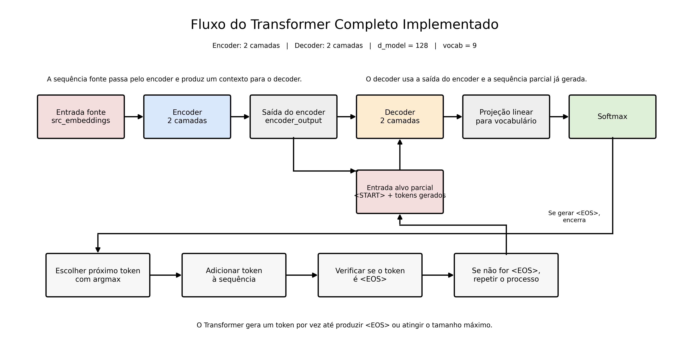

# Laboratório 4 — Implementação de um Transformer Encoder-Decoder Completo

## Objetivo

Este laboratório teve como objetivo integrar, em um único projeto, os principais componentes estudados nos laboratórios anteriores para construir um **Transformer completo**, com **encoder**, **decoder**, **projeção final para vocabulário** e **inferência auto-regressiva**.

Na prática, o projeto implementa o fluxo completo de um modelo do tipo encoder-decoder:

- a sequência de entrada é processada pelo **encoder**;
- o **decoder** recebe a saída do encoder e a sequência parcial já gerada;
- a saída do decoder é projetada para o tamanho do vocabulário;
- o modelo gera um token por vez até encontrar o token `<EOS>` ou atingir o tamanho máximo definido.


## Estrutura de pastas

```
implementando-transformer/
├── main.py
├── config.py
├── math_utils.py
├── attention.py
├── masking.py
├── feed_forward.py
├── encoder.py
├── decoder.py
├── transformer.py
├── inference.py
├── visualization.py
├── requirements.txt
├── outputs/
└── README.md
```

### Descrição dos arquivos

- **main.py**  
  Arquivo principal do projeto. Executa os testes das etapas do laboratório e integra visualização, forward completo e inferência fim a fim.

- **config.py**  
  Centraliza os hiperparâmetros, dimensões do modelo, tamanho do vocabulário, quantidade de camadas e tokens especiais.

- **math_utils.py**  
  Reúne funções matemáticas auxiliares, como `softmax`, `relu` e `layer_norm`.

- **attention.py**  
  Implementa a atenção escalada genérica, reutilizável tanto no encoder quanto no decoder.

- **masking.py**  
  Implementa a máscara causal usada na self-attention mascarada do decoder.

- **feed_forward.py**  
  Implementa a Feed-Forward Network (FFN) usada nas camadas do encoder e do decoder.

- **encoder.py**  
  Implementa uma camada do encoder e a pilha completa de camadas do encoder.

- **decoder.py**  
  Implementa uma camada do decoder e a pilha completa de camadas do decoder, incluindo masked self-attention e cross-attention.

- **transformer.py**  
  Integra encoder e decoder em um Transformer completo e adiciona a projeção final para o vocabulário.

- **inference.py**  
  Implementa a inferência auto-regressiva, gerando tokens um a um até `<EOS>`.

- **visualization.py**  
  Gera o diagrama visual do fluxo geral do Transformer implementado.

- **requirements.txt**  
  Lista as dependências necessárias para executar o projeto.

- **outputs/**  
  Pasta onde são salvos os arquivos gerados, como a imagem da arquitetura.

- **README.md**  
  Documentação do projeto.

## Como rodar o código

### 1. Criar e ativar o ambiente virtual

No macOS/Linux com fish shell:

```
python3 -m venv .venv
source .venv/bin/activate.fish
```

No bash/zsh:

```
python3 -m venv .venv
source .venv/bin/activate
```

### 2. Instalar as dependências

```
python -m pip install --upgrade pip
python -m pip install -r requirements.txt
```

### 3. Executar o projeto

```
python main.py
```

Ou, dependendo do ambiente:

```
python3 main.py
```

## Arquitetura geral do Transformer

Este projeto implementa um **Transformer encoder-decoder completo**, organizado da seguinte forma:

```
Entrada fonte  
→ Encoder  
→ Saída do encoder  
→ Decoder  
→ Projeção linear para vocabulário  
→ Softmax  
→ Próximo token
```

Além disso, durante a inferência, existe um laço:

```
Escolher próximo token  
→ Adicionar token à sequência  
→ Verificar se é `<EOS>`  
→ Se não for, repetir
```



## Explicação dos valores escolhidos em `config.py`

### `SEED = 42`

Esse valor foi definido para garantir **reprodutibilidade**.  
Sem uma seed fixa, os pesos aleatórios mudariam a cada execução, o que dificultaria testar e comparar resultados.

### `D_MODEL = 128`

`d_model` representa a dimensão interna das representações vetoriais do Transformer.

Foi escolhido o valor **128** porque:

- é suficientemente grande para simular um Transformer de forma realista;
- mantém o projeto leve para execução local;
- facilita os testes sem exigir alto custo computacional.

Esse valor define o tamanho dos embeddings e das saídas intermediárias do encoder e do decoder.

### `D_K = 128`

`d_k` representa a dimensão usada nas projeções de `Q`, `K` e `V` na atenção.

Neste laboratório, foi definido como **128**, igual a `d_model`, para que a soma residual funcionasse diretamente sem exigir uma camada extra de projeção da saída da atenção.

Em outras palavras: essa escolha simplifica a implementação sem quebrar a lógica do Transformer.

### `D_FF = 256`

A Feed-Forward Network interna expande a dimensão de `128` para `256` e depois projeta de volta para `128`.

Essa escolha segue a lógica do Transformer:

- primeiro expandir a representação;
- aplicar não-linearidade;
- depois voltar para a dimensão original.

Foi escolhido **256** por ser o dobro de `128`, mantendo a implementação simples e didática.

### `SRC_SEQ_LEN = 6`

Esse valor representa o comprimento da sequência de entrada usada nos testes.

Foi definido como **6** porque é suficiente para demonstrar o fluxo do encoder sem tornar os exemplos grandes demais.

No projeto, isso aparece em sequências como:

- `eu`
- `gosto`
- `de`
- `pinguins`
- `muito`
- `fim`


### `TGT_SEQ_LEN = 5`

Esse valor representa o comprimento inicial da sequência alvo usada em alguns testes do decoder.

Foi escolhido como **5** por ser suficiente para validar:

- máscara causal;
- cross-attention;
- projeção final para vocabulário.


### `VOCAB_SIZE = 9`

O vocabulário do projeto é fictício e pequeno, com 9 tokens, incluindo:

- `<PAD>`
- `<START>`
- `<EOS>`
- `eu`
- `gosto`
- `de`
- `pinguins`
- `muito`
- `fim`

Esse tamanho reduzido foi escolhido porque o foco do laboratório não é a qualidade linguística da geração, mas sim o funcionamento da arquitetura.


### `N_ENCODER_LAYERS = 2` e `N_DECODER_LAYERS = 2`

No artigo original *Attention Is All You Need*, o Transformer utiliza **6 camadas no encoder e 6 no decoder**.

Neste laboratório, foram utilizadas **2 camadas** em cada stack por motivos didáticos e práticos:

- reduzir complexidade de implementação;
- facilitar debug e inspeção dos shapes;
- tornar a execução mais leve localmente;
- manter o foco na compreensão do fluxo, não na escala do modelo.

Ou seja, a escolha por 2 camadas não contradiz o paper.  
Ela é uma simplificação pedagógica para laboratório.

## Passo a passo do fluxo, conectando com os laboratórios anteriores

Este laboratório é a continuação direta dos laboratórios anteriores.

### Lab 1 — Self-Attention

Repositório:  
`https://github.com/whosbea/implementando-self-attention`

No primeiro laboratório, foi implementado o mecanismo de **self-attention**, que é a base matemática do Transformer.

Ali foi estudado:

- cálculo de `Q`, `K` e `V`;
- multiplicação `QK^T`;
- escalonamento por `sqrt(d_k)`;
- aplicação de `softmax`;
- combinação final com `V`.

Esse bloco se tornou a base do arquivo `attention.py`.

### Lab 2 — Encoder

Repositório:  
`https://github.com/whosbea/implementando-encoder`

No segundo laboratório, foi construída a pilha do **encoder**, com:

- self-attention;
- Add & Norm;
- Feed-Forward;
- Add & Norm;
- repetição em múltiplas camadas.

No Lab 4, essa lógica foi reaproveitada e integrada ao Transformer completo.

O encoder do projeto atual:
- recebe `src_embeddings`;
- produz `encoder_output`;
- fornece contexto para o decoder.


### Lab 3 — Decoder

Repositório:  
`https://github.com/whosbea/implementando-decoder`

No terceiro laboratório, foi estudado o funcionamento do **decoder**, especialmente:

- máscara causal;
- cross-attention;
- inferência auto-regressiva.

No Lab 4, essas peças foram integradas ao modelo completo.

O decoder do projeto atual:
- recebe a sequência alvo parcial;
- usa a saída do encoder;
- gera uma nova representação que será projetada para o vocabulário.


### Lab 4 — Integração completa

No quarto laboratório, todas as partes anteriores foram integradas.

O fluxo completo acontece assim:

#### 1. A sequência fonte entra no encoder

A entrada é convertida em embeddings e passada para a pilha do encoder.

O encoder processa essa sequência e gera a `encoder_output`.


#### 2. O decoder começa com `<START>`

Durante a inferência, a sequência alvo não existe pronta.  
Por isso, o processo começa com o token `<START>`.


#### 3. O decoder recebe duas entradas

O decoder usa:

- a sequência parcial já gerada;
- a saída do encoder.

Isso permite que ele gere tokens levando em conta:
- o contexto da entrada;
- o que já foi produzido até aquele momento.


#### 4. A saída do decoder é projetada para o vocabulário

A saída do decoder ainda está no espaço vetorial de dimensão `d_model`.

Então ela passa por uma projeção linear:

```
d_model → vocab_size
```

No projeto:

```
128 → 9
```

Isso gera os logits sobre o vocabulário.


#### 5. A softmax transforma logits em probabilidades

Essas probabilidades indicam qual token o modelo considera mais provável naquele passo.


#### 6. O próximo token é escolhido com `argmax`

A escolha do próximo token é feita usando o token com maior probabilidade.

Esse token é então adicionado à sequência parcial.


#### 7. O processo se repete até `<EOS>`

Após adicionar o token, o modelo verifica:

- se o token foi `<EOS>`, encerra;
- se não foi, repete o processo.

Esse laço implementa a **inferência auto-regressiva**.


## Resumo do fluxo completo

```
Sequência fonte  
→ Embeddings  
→ Encoder  
→ encoder_output  
→ Decoder com sequência parcial  
→ Projeção linear  
→ Softmax  
→ Argmax  
→ Próximo token  
→ Verificação de `<EOS>`  
→ Repetição do processo
```

## Referências

### Paper principal

VASWANI, Ashish et al.  
**Attention Is All You Need**. 2017.

## Informações importantes

Este projeto contou com apoio de IA (**ChatGPT 5.4 Thinking**) na geração e organização do código. Todo o conteúdo foi revisado, ajustado e estudado por **Beatriz Barreto**.